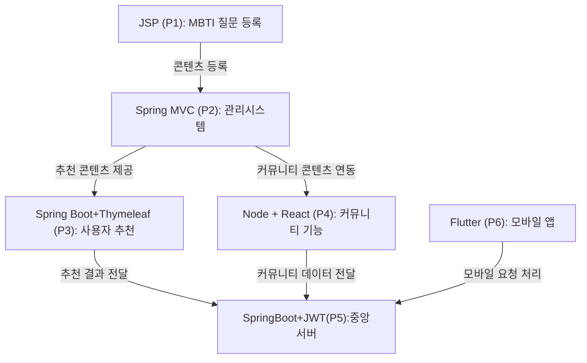
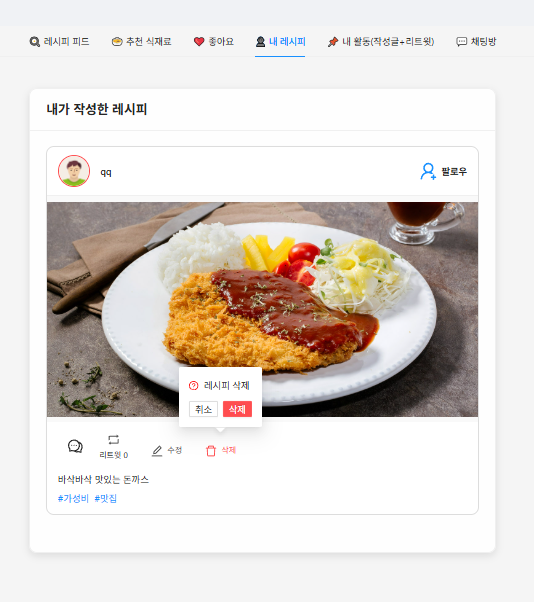
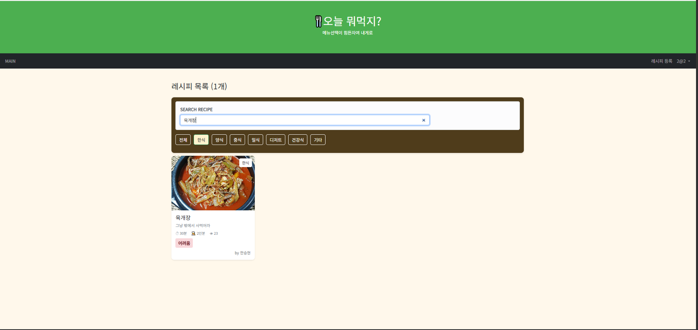
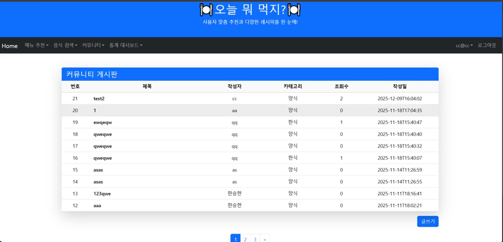
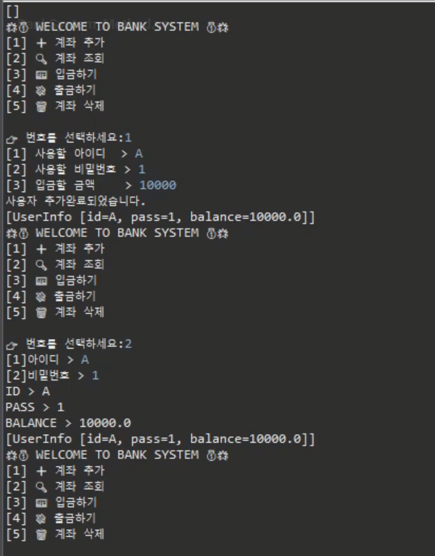
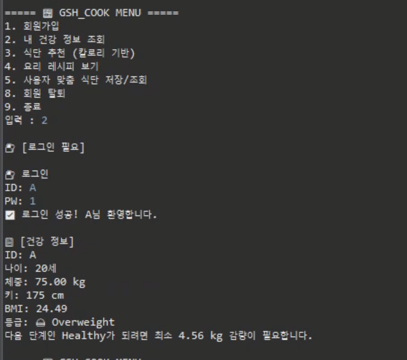
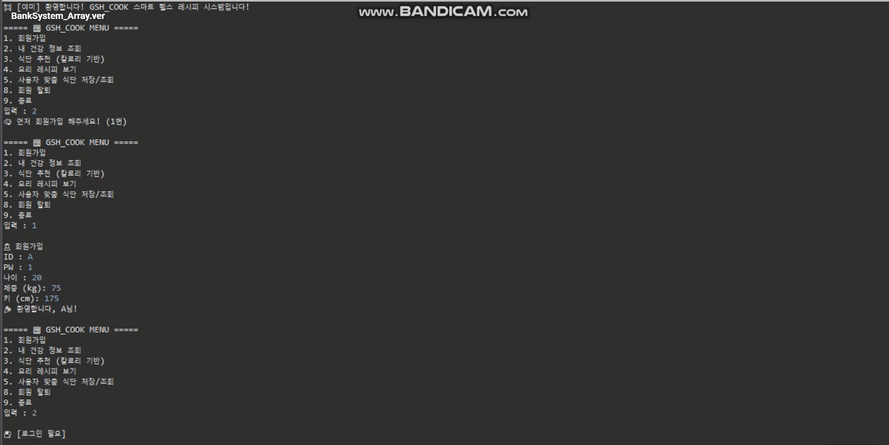
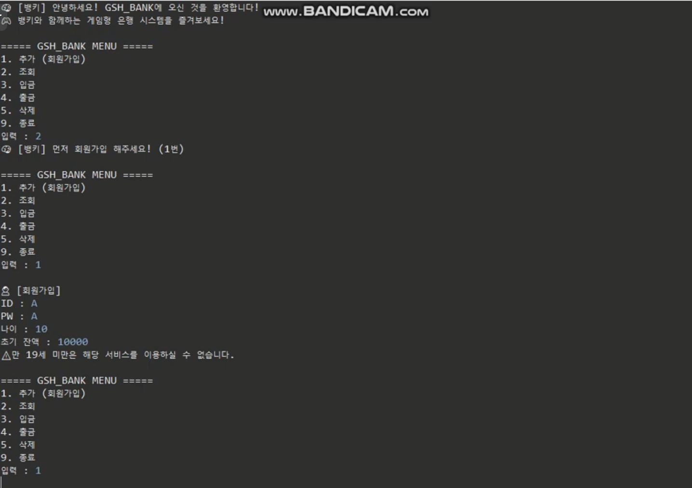

## ■ 전체 콘셉트 : MBTI 기반 성향 맞춤 플랫폼  
> 성향 기반 콘텐츠 추천 + 감정 제어 + 커뮤니티 + 일정 연결을 통합한 라이프스타일 플랫폼  
> 기술 스택: JSP, Spring MVC, Spring Boot, Node.js, React, JWT, Redis, Flutter

#### 📌1. 기획의도 : 
MBTI Universe 는 성향기반으로 콘텐츠를 추천하고, 감정을 제어하며, 커뮤티니와 일정을 연결하는 통합 라이프스타일 플랫폼입니다. 다양한 기술스택을 활용해 모듈화된 구조로 개발되었으며 실무에서 요구되는 API 설계, 보안, UX 데이터 분석까지 모두 담았습니다.

 
 

#### 📌2. 연결구조

#### 📌 프로젝트 번호 요약

| 번호 | 기술 스택 | 주요 기능 |
|------|------------|------------|
| P1 | JSP + Oracle | MBTI 질문/보기 등록 |
| P2 | (#) Spring MVC + MyBatis + JSTL | 콘텐츠/질문/일정 관리 (관리자) |
| P3 |   Spring BOOT + JPA + Thymeleaf |사용자 추천, 테스트 결과 기반 콘텐츠 |
| P4 |   Node + React  | 커뮤니티, 취향 공유 |
| P5 | (#) Spring BOOT + JPA + React + JWT + Redis |  중앙 인증 서버, 통합 API  | 
| P6 | Flutter | 모바일 UX, 앱 인터페이스 |
 

 

 
 

---

#### 💡 공통 사용자 모듈 (중앙 인증 서버 기반)  
**기술 스택**: Spring Boot + JWT + Redis  
**역할**: 회원가입, 로그인, 인증/인가, MBTI 유형 관리

**공통 테이블**:

| 테이블명       | 설명 |
|----------------|------|
| `User`         | 사용자 기본 정보 (user_id, email, password, mbti_type_id, created_at 등) |
| `MbtiType`     | MBTI 유형 정보 (예: ENFP, INTJ 등) |
| `Role`         | 사용자 역할 (관리자, 일반 사용자 등) |
| `AuthToken`    | JWT 토큰 정보 (access_token, refresh_token, 만료일 등) |
| `LoginLog`     | 로그인 이력 (user_id, login_time, ip_address 등) |

→ **각 프로젝트에서 자체적으로 로그인 기능을 구현** (예: Spring Security, JWT, 세션 기반 등)

→ 이후에  **모든 로그인/회원가입/권한 관리를 중앙 인증 서버**에서 처리

→ 각 프로젝트는 **중앙 서버에서 발급된 JWT 토큰만 검증**하고, 사용자 정보를 받아서 `user_id`를 기반으로 기능 수행 

 

 
 

---

#### 💡 **PROJECT1** MBTI 테스트 + 결과보기
**기술 스택**: JSP + Oracle  
**기능**: MBTI 질문/보기 등록, 응답 저장
  1) JSP + Oracle: MBTI 질문/보기 등록 시스템
  2) 단순 CRUD지만, 실무에서 확장 가능한 데이터 기반 설계로 접근

>기초CRUD

**주요 테이블**:
| 테이블명       | 설명 |
|----------------|------|
| `Question`     | MBTI 질문 정보 (질문 텍스트, 등록자, 등록일 등) |
| `Choice`       | 각 질문에 대한 보기 (보기 텍스트, 연결된 MBTI 유형) |
| `MbtiType`     | MBTI 유형 정보 (예: ENFP, INTJ 등) |
| `QuestionLog`  | 사용자 응답 기록 (user_id, question_id, choice_id, timestamp) |
| `Tag`          | 질문에 연결된 콘텐츠 태그 |
| `QuestionAudit`| 질문 변경 이력 관리 (변경자, 변경일, 변경 내용) |

**아이디어**
1.  A/B 테스트 기반 질문 최적화: 사용자 응답 데이터를 기반으로 질문의 유효성을 분석하고, 정확도가 낮은 질문은 자동으로 교체하거나 개선 제안
2. 유형별 응답 히트맵: 어떤 질문에 어떤 유형이 많이 반응했는지 시각화하여 질문의 편향성 분석
3. 성향 기반 콘텐츠 티저: 테스트 결과에 따라 콘텐츠 미리보기(예: ENFP는 감성적인 음악, INTJ는 자기계발서) 제공
4. AI 기반 질문 자동 생성: 기존 질문 데이터를 학습해 새로운 질문을 제안하는 기능 (GPT API 연동 가능)
5. 질문/보기 등록 시 유형 자동 태깅: 키워드 기반으로 MBTI 유형 자동 추천
6. 질문/보기 등록 시 유효성 검증: 중복 질문, 오타, 유형 불일치 자동 감지
7. 콘텐츠 연결용 태그 시스템: 질문에 콘텐츠 태그를 붙여 향후 추천 시스템과 연결 가능
8. 질문/보기 등록 이력 관리: 등록자, 등록일, 수정이력 등을 기록하여 관리 기능 강화
9. 미사용 질문 관리 기능: 테스트에 사용되지 않는 질문을 자동 분류하여 보관 또는 삭제
10. 유형별 질문 분포 통계: 각 유형에 연결된 질문 수를 시각화하여 균형 확인 가능
 

 
 

---

💡 **PROJECT2** 추천 콘텐츠 등록 및 관리 (관리자용)
**기술 스택**: Spring MVC + MyBatis + JSTL  
**기능**: 콘텐츠/질문/일정 등록 및 관리
> SPRING MVC  + Mybatis + JSTL 익히기

**주요 테이블**:
| 테이블명        | 설명 |
|-----------------|------|
| `Content`       | 콘텐츠 정보 (제목, 설명, 유형, 등록일 등) |
| `ContentTag`    | 콘텐츠 태그 정보 (예: 음악, 책, 영화 등) |
| `ContentTagMap` | 콘텐츠와 태그 연결 테이블 |
| `Schedule`      | 일정 정보 (제목, 시작/종료 시간, 알림 여부 등) |
| `AdminUser`     | 관리자 계정 정보 및 권한 |
| `ContentLog`    | 콘텐츠 등록/수정 이력 관리 |

**아이디어**
1. 콘텐츠 등록 시 자동 유형 태깅: 콘텐츠 키워드 분석을 통해 MBTI 유형을 자동 추천하여 등록자의 부담을 줄임  
2. 콘텐츠 등록 이력 관리: 등록자, 등록일, 수정일, 변경사항 등을 기록하여 추적 가능  
3. 질문/보기 등록 시 유효성 검증: 중복 질문, 오타, 유형 불일치 등을 자동 감지하여 품질 관리  
4. 일정 등록 시 자동 리마인더 설정: 일정 등록 시 기본 알림 설정을 자동으로 적용하여 사용자에게 푸시 알림 가능  
5. 콘텐츠 미리보기 기능: 등록된 콘텐츠가 사용자 화면에서 어떻게 보일지 미리 확인할 수 있는 프리뷰 기능 제공  
6. 관리자용 콘텐츠 성과 대시보드: 콘텐츠별 조회수, 클릭률, 유형별 반응률 등을 시각화하여 운영 인사이트 제공  
7. 콘텐츠 활성/비활성 토글 기능: 콘텐츠를 즉시 노출하거나 숨길 수 있는 간편 제어 기능으로 운영 유연성 확보  
8. 질문/보기 등록 시 유형별 분포 시각화: 각 유형에 연결된 질문 수를 그래프로 보여줘 균형 확인 가능  
9. 일정 등록 시 성향 기반 추천: 사용자 MBTI 유형에 따라 추천 일정 템플릿 제공 (예: ISTJ → 루틴 일정, ENFP → 이벤트 일정)  
10. 관리자 권한별 기능 제한: 콘텐츠 담당자, 일정 담당자 등 역할에 따라 메뉴 접근 권한을 분리하여 보안 강화  
 

 
 

---

💡 **PROJECT3** MBTI 성향 기반 콘텐츠 추첩 웹앱
**기술 스택**: Spring Boot + JPA + Thymeleaf  
**기능**: 추천 알고리즘, 필터링, 사용자 행동 분석

>  Spring Boot + JPA + Thymeleaf  + **공공데이터 , 각 회사별 API** 익히기

**주요 테이블**:
| 테이블명           | 설명 |
|--------------------|------|
| `User`             | 사용자 정보 (email, password, mbti_type_id 등) |
| `UserMbti`         | 사용자와 MBTI 유형 연결 |
| `Content`          | 추천 콘텐츠 정보 |
| `UserContentLog`   | 사용자의 콘텐츠 소비 기록 |
| `Feedback`         | 추천 콘텐츠에 대한 사용자 피드백 |
| `ContentPreview`   | 콘텐츠 미리보기 정보 |
| `UploadBatch`      | CSV 업로드 이력 및 오류 정보 |

**아이디어:**
1. 성향 기반 콘텐츠 추천 알고리즘: 사용자 MBTI 유형과 과거 행동 로그를 기반으로 콘텐츠를 자동 추천  
2. 실시간 인기 콘텐츠 랭킹: 유형별/전체 기준으로 조회수, 클릭률 등을 기반으로 인기 콘텐츠를 실시간으로 보여줌  
3. 성향 기반 필터링 기능: “나와 비슷한 유형이 좋아한 콘텐츠” 또는 “내 유형과 반대 성향이 선호하는 콘텐츠” 탐색 가능  
4. CSV 업로드 시 자동 정제 기능: 질문/콘텐츠 일괄 등록 시 중복, 오타, 유형 불일치 등을 자동 감지  
5. 추천 콘텐츠 미리보기 기능: 추천된 콘텐츠를 사용자 화면에서 어떻게 보일지 미리 확인 가능  
6. 사용자 행동 기반 콘텐츠 리마인더: 특정 유형의 사용자가 자주 보는 콘텐츠를 일정 주기로 다시 추천  
7. 콘텐츠 태그 기반 추천 확장: 콘텐츠에 연결된 태그를 기반으로 유사 콘텐츠 자동 탐색  
8. 추천 정확도 피드백 수집: 사용자가 추천 콘텐츠에 대해 “정확함/무관함” 등의 피드백을 남기면 알고리즘 개선에 반영  
9. 유형별 콘텐츠 소비 패턴 분석: 어떤 유형이 어떤 시간대에 어떤 콘텐츠를 선호하는지 시각화  
10. 추천 콘텐츠 공유 기능: 사용자가 추천받은 콘텐츠를 커뮤니티나 외부 SNS에 공유할 수 있도록 연동
 

 
 

---

💡 **PROJECT4**  MBTI 커뮤티니  + 취향 공유 플랫폼
**기술 스택**: Node.js + React  
**기능**: 커뮤니티, 감정 공유, 사용자 간 상호작용

>  NODE + REACT 익히기

**주요 테이블**:
| 테이블명     | 설명 |
|--------------|------|
| `Post`       | 커뮤니티 게시글 정보 |
| `Comment`    | 게시글에 대한 댓글 |
| `Like`       | 게시글 좋아요 정보 |
| `EmotionTag` | 게시글에 연결된 감정 태그 |
| `User`       | 사용자 정보 |
| `InteractionLog` | 유형 간 상호작용 기록 (예: ENFP가 INTJ 게시글에 반응한 횟수 등) |

**아이디어:**
1. 유형별 전용 라운지: 각 MBTI 유형별 전용 게시판을 제공하여 성향에 맞는 대화 공간 구성  
2. 감정 태그 기반 탐색: 게시글에 감정 태그(예: 기쁨, 불안, 설렘)를 붙여 감정 기반 콘텐츠 탐색 가능  
3. 취향 기반 친구 추천: 유사한 콘텐츠 소비 패턴과 성향을 가진 사용자 간 매칭 기능 제공  
4. 성향 기반 반응 이모티콘 추천: 댓글 작성 시 MBTI 유형에 맞는 반응 이모티콘 자동 추천  
5. 커뮤니티 활동 통계 시각화: 사용자 유형별 게시글 수, 댓글 수, 좋아요 수 등을 대시보드로 제공  
6. 인기 토픽 자동 분류: 게시글 키워드를 분석해 실시간 인기 주제를 유형별로 자동 분류  
7. 게시글 작성 시 성향 기반 콘텐츠 추천: 글을 쓰는 도중 관련 콘텐츠를 자동으로 추천하여 연결성 강화  
8. 커뮤니티 내 콘텐츠 공유 기능: 추천 콘텐츠를 커뮤니티 게시글에 바로 삽입하거나 공유 가능  
9. 사용자 감정 변화 분석: 게시글과 댓글의 감정 태그를 기반으로 사용자 감정 흐름을 분석  
10. 유형 간 상호작용 분석: 어떤 유형이 어떤 유형의 게시글에 더 많이 반응하는지 시각화하여 커뮤니티 연결성 강화
 

 
 

---

💡 **PROJECT5**  MBTI 기반 라이프스트일 통합 앱 + 수익형
**기술 스택**: Spring Boot + JWT + Redis + React  
**기능**: 인증, 수익화, 사용자 분석

>  중앙서버 통합형

**주요 테이블**:
| 테이블명        | 설명 |
|-----------------|------|
| `User`          | 사용자 정보 및 역할 |
| `AuthToken`     | JWT 인증 토큰 관리 |
| `Role`          | 사용자 권한 정보 |
| `Ad`            | 광고 정보 (타겟 유형, 콘텐츠, 클릭률 등) |
| `Product`       | 굿즈 상품 정보 |
| `Order`         | 사용자 구매 내역 |
| `Subscription`  | 콘텐츠 구독 정보 |
| `RevenueLog`    | 수익 기록 (광고, 굿즈, 구독 등) |

**아이디어:**
1. 성향 기반 광고 추천 시스템: 사용자 MBTI 유형과 콘텐츠 소비 패턴을 기반으로 맞춤형 광고 노출  
2. MBTI 굿즈 스토어 연동: 유형별 굿즈(노트, 스티커, 다이어리 등)를 연결하여 수익화 가능  
3. 사용자 행동 분석 리포트: 콘텐츠 소비, 커뮤니티 활동, 감정 기록 등을 분석해 개인화 리포트 제공  
4. JWT 기반 인증/인가 구조: 사용자 역할(Role)에 따라 기능 접근을 제어하고 보안 강화  
5. Redis 기반 세션 관리: 빠른 인증 처리와 확장성 확보를 위한 캐시 기반 세션 구조  
6. 성향 기반 콘텐츠 구독 모델: 유형별 콘텐츠를 주기적으로 제공하는 유료 구독 서비스 설계  
7. 관리자용 수익 대시보드: 유형별 광고 클릭률, 굿즈 판매량, 구독 유지율 등을 시각화  
8. 사용자 리텐션 분석: 유형별로 재방문율, 이탈율 등을 분석하여 UX 개선에 활용  
9. 성향 기반 콘텐츠 번들 판매: 예: “INTJ 자기계발 패키지”, “ENFP 감성 콘텐츠 묶음” 등 번들화  
10. API 기반 외부 서비스 연동: MBTI 결과를 외부 앱이나 서비스에 연동할 수 있도록 API 제공

 
 

---

💡 **PROJECT6**  모바일 UX 최적화 앱  
**기술 스택**: Flutter  
**기능**: 감정 기록, 콘텐츠 추천, UX 개인화

>  모바일 UX

**주요 테이블**:
| 테이블명       | 설명 |
|----------------|------|
| `UserEmotion`  | 사용자의 감정 기록 (날짜, 감정 태그, 메모 등) |
| `DailyMission` | 성향 기반 데일리 미션 정보 |
| `MobileTheme`  | MBTI 유형별 테마 설정 정보 |
| `PushLog`      | 푸시 알림 발송 기록 |
| `MobileContent`| 모바일 전용 콘텐츠 정보 | 

**아이디어:**
1. 성향별 테마 자동 적용: 사용자 MBTI 유형에 따라 앱의 색상, 폰트, 애니메이션 스타일을 자동 변경  
2. 감정 기록 기능: 하루의 감정을 기록하고, 성향에 따라 힐링 콘텐츠를 자동 추천  
3. 성향 기반 데일리 미션 제공: 유형별로 맞춤형 행동 미션을 제안 (예: ENFP → 새로운 사람에게 인사하기)  
4. 푸시 알림 최적화: MBTI 유형별로 선호하는 시간대와 메시 톤에 맞춰 알림을 자동 조정  
5. 콘텐츠 스와이프 추천: Tinder 스타일의 콘텐츠 추천 UX로 직관적 탐색 제공  
6. 오프라인 모드 지원: 감정 기록, 콘텐츠 열람 등을 오프라인에서도 가능하게 하여 접근성 강화  
7. 성향 기반 홈 화면 구성: 유형별로 자주 사용하는 기능을 홈 화면에 우선 배치  
8. 사용자 활동 리포트: 주간/월간 감정 변화, 콘텐츠 소비 패턴 등을 리포트로 제공  
9. 모바일 전용 콘텐츠 티저: 모바일 UX에 최적화된 짧은 콘텐츠 미리보기 제공  
10. 앱 내 커뮤니티 연동: 커뮤니티 인기 글을 모바일에서 바로 확인하고 반응 가능
 

<!DOCTYPE html>
<html lang="ko">

<head>
    <meta charset="utf-8" />
    <meta name="viewport" content="width=device-width, initial-scale=1" />
    <title>🚀 길상현 — 포트폴리오</title>
    <link
        href="https://fonts.googleapis.com/css2?family=Inter:wght@300;400;600;800&family=Noto+Sans+KR:wght@300;400;700&display=swap"
        rel="stylesheet">
    

</head>

    

        <!-- <button class="icon-btn" id="themeToggle" title="배경 전환">🌗</button> -->
        <button class="icon-btn" id="download" title="이력서 다운로드">📄</button>
    

    <section id="hero" class="hero star-bg">
        

            

                
길상현

                
Fullstack Engineer · 도전하는 개발자

            

        

    </section>

    

        <main class="wrap">
            <!-- Section Nav -->
            <nav class="section-nav fixed" id="sectionNav">
                <button data-target="about">About</button>
                <button data-target="skills">Skills</button>
                <button data-target="career">Career</button>
                <button data-target="portfolio">Portfolio</button>
                <button data-target="contact">Contact</button>
            </nav>

            <section id="about" class="block scroll-item slide-left">
                <h2 class="section-title">About Me</h2>
                

                    

                    

                        
길상현

                        
Fullstack Engineer

                        

                            📧 shgil0618@gmail.com
                            📍 부천(Bucheon), Korea
                            🔗
                                <a href="https://github.com/shgil0618-glitch/fullstack_gsh.git/project" target="_blank"
                                    style="text-decoration: none; color: inherit;">
                                    개인 깃허브 : github.com/shgil0618
                                </a>
                            
                            🔗
                                <a href="https://github.com/shgil0618-glitch/Bug-Hunters.git" target="_blank"
                                    style="text-decoration: none; color: inherit;">
                                    팀 깃허브 : github.com/shgil0618
                                </a>
                            

                        

                        
끊임없이 도전하고 성장하는 풀스택 개발자

                    

                

            </section>

            <section class="block scroll-item slide-left">
                <h2 class="section-title">확장성과 실행력을 갖춘 풀스택 개발자 </h2>
                

            </section>

            <section class="block scroll-item slide-right">
                <h2 class="section-title">핵심 역량</h2>

                <ul class="strength-list">
                    <li>
                        시스템 프로그래밍(C/C++)과 자동화 소프트웨어 유지보수 경험을 바탕으로,
                        <strong>문제를 구조적으로 분석하고 안정적으로 해결하는 역량</strong>
                    </li>
                    <li>
                        Java·Spring Boot·React 기반의 웹 프로젝트를 통해
                        <strong>아이디어를 실제 서비스로 구현하며 확장성을 고려한 개발 경험</strong>
                    </li>
                    <li>
                        하드웨어–소프트웨어, 백엔드–프론트엔드를 아우르는 경험을 통해
                        <strong>다양한 환경에서도 빠르게 적응하고 실행하는 개발자</strong>
                    </li>
                    <li>
                        프로젝트 일정 지연 위기와 팀 활동 경험을 통해 쌓은
                        <strong>협업 중심의 문제 해결과 책임감 있는 역할 수행</strong>
                    </li>
                </ul>
            </section>

            <section id="skills" class="block scroll-item slide-left">
                <h2 class="section-title">Skills</h2>
                

                    프로젝트 및 실무 경험을 통해 사용해온 기술 스택입니다.
                

                

                    

                        <h3>BACK-END</h3>
                        

                            Java 11,
                            Spring Framework 4.3 / 6.0,
                            Spring Boot 2.7 / 3.4,
                            RESTful API (JSON),
                            MyBatis 3.5,
                            JSP 2.3
                        

                    

                    

                        <h3>FRONT-END</h3>
                        

                            HTML5, CSS3,
                            JavaScript ES6,
                            jQuery 3.7,
                            Axios 1.6
                        

                    

                    

                        <h3>SERVER / INFRA</h3>
                        

                            Apache Tomcat 9.0,
                            Nginx 1.18,
                            AWS EC2 · RDS · IAM
                        

                    

                    

                        <h3>DB</h3>
                        

                            Oracle 11g,
                            MySQL 8.0,
                            JWT,
                            MyBatis 3.5
                        

                    

                    

                        <h3>TOOLS</h3>
                        

                            IntelliJ IDEA,
                            Eclipse,
                            Visual Studio Code
                        

                    

                    

                        <h3>COLLABORATION</h3>
                        

                            Git, GitHub,
                            Discord,
                            Figma,
                            Google Sheets
                        

                    

                

            </section>

            <!-- <section id="skills" class="block scroll-item slide-left">
                <h2 class="section-title">Skills & Tools</h2>
                
실무에서 쓰는 기술과 툴을 시각적으로 빠르게 파악할 수 있도록 구성했습니다.

                

                    

                        

                            
90%

                        

                        
React

                    

                    

                        

                            
80%

                        

                        
Spring

                    

                    

                        

                            
85%

                        

                        
AWS

                    

                    

                        

                            
75%

                        

                        
TypeScript

                    

                

                

                    
React

                    
Spring Boot

                    
Docker

                    
GitHub Actions

                    
Postgres

                    
AWS (ECS, S3)

                

            </section> -->

            <section id="career" class="block scroll-item slide-right">
                <h2 class="section-title">Career</h2>
                

                    

                        <h4>2025 — 2026 | 풀스택 개발자 교육 이수</h4>
                        
프론트엔드부터 백엔드까지 웹 개발 전반의 기술을 프로젝트 중심으로 체계적으로 습득

                    

                    

                        <h4>2024 — 2024 | SI기업 소프트웨어 유지보수</h4>
                        
실제 자동화 설비 시스템을 다루며 문제 해결 중심의 유지보수 업무 경험

                    

                    

                        <h4>2023 — 2024 | 코딩 동아리 활동</h4>
                        
교과 외 프로젝트와 코드 리뷰를 통해 실무에 가까운 개발 방식에 대한 경험

                    

                    

                        <h4>2022 - 2023 | 정보통신공학과 부학생회장</h4>
                        
행사 기획과 학생 간 소통을 주도하며 리더십과 협업의 중요성에 대한 깊은 배움

                    

                    

                        <h4>2018 - 2024 | 컴퓨터공학부 정보통신학과</h4>
                        
운영체제, 네트워크, 알고리즘 등 전공 지식을 기반으로 개발의 기초를 체계적으로 익힘

                    

                

            </section>

            <section id="portfolio" class="block scroll-item slide-left">
                <h2 class="section-title">Portfolio</h2>

                

                    <button class="slide-btn left" onclick="prevSlide()">◀</button>

                    

                        <!-- 슬라이드 3 : 미니 프로젝트 클론 -->
                        

                            <h3 class="portfolio-subtitle">🧪 미니 프로젝트</h3>
                            

                                <!-- 소규모 카드 -->
                            

                        

                        <!-- 슬라이드 1 : 팀 프로젝트 -->
                        

                            <h3 class="portfolio-subtitle">👥 팀 프로젝트</h3>
                            

                                <!-- 카드 8 -->
                                

                                    

                                        

                                            <!-- 왼쪽 대표 이미지 -->
                                            

                                                
                                            

                                            <!-- 오른쪽 기존 글 영역 (복붙) -->
                                            

                                                <h3>Project 4 - 오늘 뭐먹지? SNS</h3>

                                                

                                                    레시피 공유 기반 SNS 웹 서비스 구축 프로젝트
                                                

                                                

                                                    
📅 기간: 2026.01

                                                    
👥 구분: 팀 프로젝트 (4명)

                                                    
🔥 핵심 해결: SNS 인터랙션 · 실시간 통신 · 상태 관리

                                                    
🎯 역할: 게시글 CRUD · 좋아요 · 리트윗 · 해시태그 · 소켓 통신

                                                

                                                

                                                    
Spring Boot

                                                    
JPA

                                                    
Redis

                                                    
JWT

                                                    
React

                                                    
WebSocket

                                                

                                            

                                        

                                        

                                            <h3>핵심 기술</h3>
                                            

                                                SNS 인터랙션 설계 · 실시간 통신 · 상태 기반 백엔드 구조
                                            

                                        

                                    

                                

                                <!-- 카드 7 -->
                                

                                    

                                        

                                            

                                                
                                            

                                            

                                                <h3>Project 3 - 오늘 뭐먹지? v2</h3>
                                                

                                                    레시피 추천 UGC 웹 서비스 기능 고도화 프로젝트
                                                

                                                

                                                    
📅 기간: 2025.12 ~ 2026.01

                                                    
👥 구분: 팀 프로젝트 (4명)

                                                    
🔥 핵심 해결: 검색 성능 개선 · API 비용 최적화

                                                    
🎯 역할: 검색 로직 · API 연동 · 데이터 구조 개선

                                                

                                                

                                                    
Spring Boot

                                                    
MyBatis

                                                    
Oracle

                                                    
REST API

                                                    
Bootstrap

                                                

                                            

                                        

                                        

                                            <h3>핵심 기술</h3>
                                            
검색 쿼리 최적화 · 외부 API 연동 · 비용 최적화 설계

                                        

                                    

                                

                                <!-- 카드 6 -->
                                

                                    

                                        

                                            

                                                
                                            

                                            

                                                <h3>Project 2 - 오늘 뭐먹지? v1</h3>
                                                

                                                    Spring · MyBatis 기반 레시피 UGC 웹 서비스 구축 프로젝트
                                                

                                                

                                                    
📅 기간: 2025.11 ~ 2025.12

                                                    
👥 구분: 팀 프로젝트 (3명)

                                                    
🔥 핵심 해결: 검색·페이징 성능 개선 · 권한별 UI 설계

                                                    
🎯 역할: 게시판 CRUD · 검색 로직 · AJAX 페이징

                                                

                                                

                                                    
Spring MVC

                                                    
MyBatis

                                                    
Oracle

                                                    
jQuery

                                                    
Bootstrap

                                                

                                            

                                        

                                        

                                            <h3>핵심 기술</h3>
                                            
CRUD 설계 · SQL 최적화 · AJAX 기반 UX 개선

                                        

                                    

                                

                                <!-- 카드 5 -->
                                

                                    

                                        

                                            

                                                
                                            

                                            

                                                <h3>Project 1 - Eclipse Java</h3>
                                                

                                                    콘솔 기반 Java 팀 프로젝트로 핵심 로직과 데이터 흐름 구현
                                                

                                                

                                                    
📅 기간: 2024.11 – 2024.12

                                                    
👥 구분: 팀 프로젝트

                                                    
🔥 핵심 해결: 메뉴 흐름 제어 및 데이터 처리 구조화

                                                    
🎯 역할: 레시피 로직 · 입력 처리 · 데이터 관리

                                                

                                                

                                                    
Java

                                                    
Eclipse

                                                    
Console

                                                

                                            

                                        

                                        

                                            <h3>핵심기술</h3>
                                            
조건문 · 반복문 · 컬렉션 · 예외 처리

                                        

                                    

                                

                            

                        

                        <!-- 슬라이드 2 : 개인 프로젝트 -->
                        <!-- 

                            <h3 class="portfolio-subtitle">👤 개인 프로젝트</h3>
                            
 -->
                        <!-- Bank / Project 1~5 카드 -->
                        <!-- 카드 9 -->
                        <!-- 

                                    

                                        

                                            <h3>Project 5 - 개인 프로젝트</h3>
                                            
학습한 기술을 종합해 구현한 개인 프로젝트

                                            

                                                
📅 기간: 2025.06

                                                
👥 구분: 개인 프로젝트

                                                
🔥 핵심 해결: 전체 흐름 직접 설계 및 구현

                                                
🎯 역할: 기획 · 설계 · 개발 전 과정

                                            

                                            

                                                
Fullstack

                                                
설계

                                                
리팩토링

                                            

                                        

                                        

                                            <h3>핵심기술</h3>
                                            
문제 해결 중심 설계 · 전체 구조 이해

                                        

                                    

                                

                            

                        
 -->

                        <!-- 슬라이드 3 : 미니 프로젝트 -->
                        

                            <h3 class="portfolio-subtitle">🧪 미니 프로젝트</h3>
                            

                                <!-- 카드 4 -->
                                

                                    

                                        

                                            

                                                
                                            

                                            

                                                <h3>Bank System - OOP.Ver</h3>
                                                

                                                    객체지향 설계로 리팩토링한 뱅킹 시스템
                                                

                                                

                                                    
📅 기간: 2026.02

                                                    
👥 구분: 개인 프로젝트

                                                    
🔥 핵심 해결: 배열·절차형 구조를 객체 단위로 분리

                                                    
🎯 역할: 전체 설계 · 클래스 분리 · 기능 구현

                                                

                                                

                                                    
Java

                                                    
OOP

                                                    
Method 분리

                                                

                                            

                                        

                                        

                                            <h3>핵심기술</h3>
                                            

                                                UserInfo 모델 분리 
                                                기능별 클래스 구조화 
                                                객체 참조 공유 (DI 개념)
                                            

                                        

                                    

                                

                                <!-- 카드 3 (최고) -->
                                

                                    

                                        

                                            

                                                
                                            

                                            

                                                <h3>Health System - Recipe.Ver</h3>
                                                

                                                    건강 정보 기반 맞춤 식단 추천 시스템
                                                

                                                

                                                    
📅 기간: 2025.06

                                                    
👥 구분: 개인 프로젝트

                                                    
🔥 핵심 해결: BMI 계산 기반 맞춤 식단 추천

                                                    
🎯 역할: 배열 구조 설계 · 조건 필터 구현

                                                

                                                

                                                    
Java

                                                    
배열

                                                    
상태관리

                                                    
실생활도메인

                                                

                                            

                                        

                                        

                                            <h3>핵심기술</h3>
                                            

                                                다중 사용자 배열 관리 
                                                BMI 계산 로직 
                                                영양소 조건 필터링
                                            

                                        

                                    

                                

                                <!-- 카드 2 -->
                                

                                    

                                        

                                            

                                                
                                            

                                            

                                                <h3>Bank System - Array.Ver</h3>
                                                

                                                    배열 기반 다중 사용자 계좌 관리 시스템
                                                

                                                

                                                    
📅 기간: 2025.03

                                                    
👥 구분: 개인 프로젝트

                                                    
🔥 핵심 해결: 사용자별 배열 관리 및 충돌 방지

                                                    
🎯 역할: 배열 구조 설계 · 로그인 기준 데이터 접근 구현

                                                

                                                

                                                    
Java

                                                    
배열

                                                    
다중사용자

                                                

                                            

                                        

                                        

                                            <h3>핵심기술</h3>
                                            

                                                사용자별 인덱스 관리 
                                                로그인 사용자 기준 데이터 접근 
                                                배열 충돌 문제 해결
                                            

                                        

                                    

                                

                                <!-- 카드 1 -->
                                

                                    

                                        

                                            

                                                
                                            

                                            

                                                <h3>Bank System - Control.Ver</h3>
                                                

                                                    조건문과 상태 제어로 구현한 콘솔 기반 뱅킹 시스템
                                                

                                                

                                                    
📅 기간: 2025.01

                                                    
👥 구분: 개인 프로젝트

                                                    
🔥 핵심 해결: switch-case 및 level 변수로 메뉴 상태 제어

                                                    
🎯 역할: 전체 로직 설계 · 상태 관리 구현

                                                

                                                

                                                    
Java

                                                    
조건문

                                                    
상태관리

                                                

                                            

                                        

                                        

                                            <h3>핵심기술</h3>
                                            

                                                switch-case 기반 메뉴 흐름 
                                                level 변수 상태 제어 
                                                로그인 전·후 기능 접근 분리
                                            

                                        

                                    

                                

                            

                        

                        <!-- 슬라이드 1 : 팀 프로젝트 클론 -->
                        

                            <h3 class="portfolio-subtitle">🧪 팀 프로젝트</h3>
                            

                                <!-- 소규모 카드 -->
                            

                        

                    

                    <button class="slide-btn right" onclick="nextSlide()">▶</button>
                

            </section>

            <!-- <section id="portfolio" class="block scroll-item slide-left">
                <h2 class="section-title">Selected Projects (timeline)</h2>

                

                

            </section> -->

            <section class="block scroll-item fade-in">
                <h2 class="section-title" style="text-align: center;">앞으로의 방향</h2>
                

                    빠르게 적응하고 책임 있게 실행하며, 팀과 함께 해결하며 신뢰를 쌓는 개발자가 되겠습니다. 
                    감사합니다.
                

            </section>

            <section id="contact" class="block">
                <h2 class="section-title"></h2>
                

                    
Contact Me

                    
문의나 협업 제안은 언제든 환영합니다!

                    <form class="contact-form" onsubmit="sendEmail2(event)">
                        <input type="text" id="name2" name="name" placeholder="작성자 이름" required>
                        <input type="email" id="email2" name="email" placeholder="작성자 이메일" required>
                        <textarea id="message2" name="message" placeholder="메시지" rows="5" required></textarea>
                        <button type="submit">보내기</button>
                    </form>
                

            </section>

            <!-- EmailJS Script -->
            
            

            

            <script>

                function openModal(project) {
                    const modal = document.getElementById("projectModal");
                    const body = document.getElementById("modalBody");

                    const content = {
                        bank1: `
                            <h2>Bank System - Control.Ver</h2>
                            

                            <iframe 
                                src="https://www.youtube.com/embed/M0sg6rhlKfI" 
                                title="Bank System OOP.Ver" 
                                frameborder="0" 
                                allow="accelerometer; autoplay; clipboard-write; encrypted-media; gyrosc